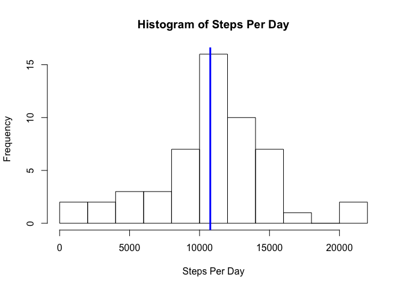
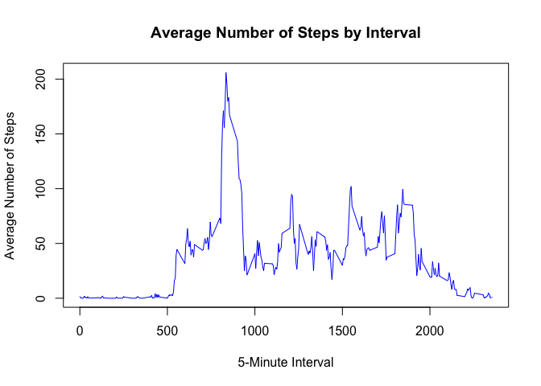
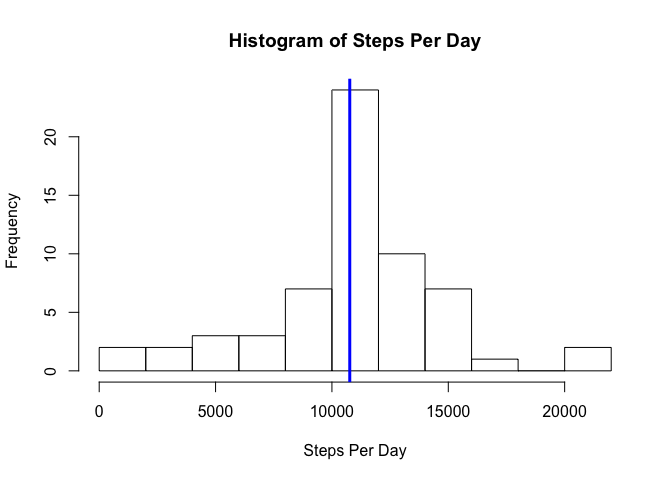
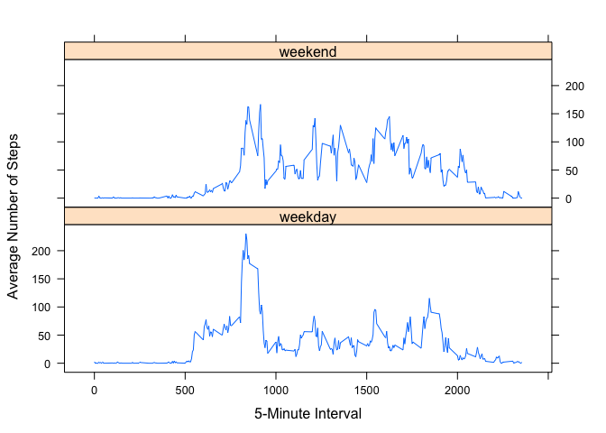

# Reproducible Research, Project 1: Activity Monitoring Data

This course project makes use of data from a personal activity monitoring device. The device records the number of steps taken by a single individual and records that number at 5-minute intervals throughout the day over a two month period. 

The data can be obtained as follows:


```r
if(!file.exists("RR")){dir.create("RR")} 
temp <- tempfile()
url <- "https://d396qusza40orc.cloudfront.net/repdata%2Fdata%2Factivity.zip"
download.file(url, temp)
unzip(temp, exdir = "RR")
unlink(temp)
```

We read the data:


```r
activity <- read.csv("activity.csv")
```

## Mean Total Number of Steps Taken Per Day

We find the total number of steps taken per day and make a histogram:


```r
stepsbyday <- aggregate(steps ~ date, activity, sum)
hist(stepsbyday$steps, breaks = 10, xlab = "Steps Per Day", main = "Histogram of Steps Per Day")
abline(v = mean(stepsbyday$steps), col = "blue", lwd = 3)
```



As shown by the blue vertical line in the histogram above, the mean of the total number of steps taken per day is 


```r
mean(stepsbyday$steps)
```

```
## [1] 10766.19
```

The median of the total number of steps taken per day is close to the mean: 


```r
median(stepsbyday$steps)
```

```
## [1] 10765
```

## Average Daily Activity Pattern

We make a time-series plot of the 5-minute intervals and the average number of steps taken, averaged across all days.


```r
stepsbyinterval <- aggregate(steps ~ interval, activity, mean)
plot(stepsbyinterval, type = "l", col = "blue", xlab = "5-Minute Interval", ylab = "Average Number of Steps", main = "Average Number of Steps by Interval")
```



The 5-minute interval with the maximum number of steps is


```r
stepsbyinterval$interval[which.max(stepsbyinterval$steps)]
```

```
## [1] 835
```

## Imputing Missing Values

The total number of missing values in the dataset is


```r
sum(is.na(activity))
```

```
## [1] 2304
```

We will replace missing values with the mean number of steps across all days for that interval. 


```r
activity$meansteps <- rep(stepsbyinterval$steps, 61)
activity$steps[is.na(activity$steps)] <- activity$meansteps[is.na(activity$steps)]
```

Now that the missing data has been replaced by numerical values, we compute a new histogram of the total number of steps taken each day. 


```r
newstepsbyday <- aggregate(steps ~ date, activity, sum)
hist(newstepsbyday$steps, breaks = 10, xlab = "Steps Per Day", main = "Histogram of Steps Per Day")
abline(v = mean(newstepsbyday$steps), col = "blue", lwd = 3)
```



Now the mean total number of steps per day is


```r
mean(newstepsbyday$steps)
```

```
## [1] 10766.19
```

and the median total number of steps per day is 


```r
median(newstepsbyday$steps)
```

```
## [1] 10766.19
```

We see that the mean is unchanged and the median is virtually unchanged, increasing by approximately 1. Imputing the data has almost no impact on estimates of the total daily number of steps. 

## Differences In Activity Patterns Between Weekdays and Weekends

We create a new factor variable in the dataset with two levels, "weekday" and "weekend," indicating the type of each date.


```r
activity$weektime <- weekdays(as.Date(activity$date))
activity$weektime[activity$weektime %in% c("Saturday", "Sunday")] <- "weekend"
activity$weektime[(activity$weektime != "weekend")] <- "weekday"
activity$weektime <- as.factor(activity$weektime)
```

Finally, we make a panel plot containing two time-series plots -- one for weekdays and one for weekends -- of the 5-minute intervals and the average number of steps taken.


```r
library(lattice)
avgsteps <- aggregate(steps ~ interval + weektime, activity, mean)
xyplot(steps ~ interval | weektime, avgsteps, type = "l", layout = c(1, 2), xlab = "5-Minute Interval", ylab = "Average Number of Steps")
```


